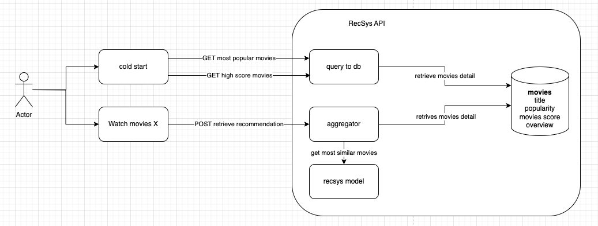

# Recommender System API with Content Based Filtering Flavour

## What does this do?
API implementation of [this article](https://towardsdatascience.com/beginners-recommendation-systems-with-python-ee1b08d2efb6
)

Diagram of this API <br/>


## Pre-Setup
1. Create the python virtual env
    ```bash
    python3 -m venv venv
    ```
2. Activate the virtual env
	```bash
    source venv/bin/activate
    ```
3. install poetry library and install project dependencies
    ```bash
    pip3 install poetry
    ```
    ```bash
    poetry install
    ```
4. Create `.env` file with proper content. Please follow the `.env-example` file
5. Prepare `kaggle.json` file as the credential to be able download dataset from internet
6. Download dataset from kaggle with this command
    ```bash
    ./scripts/download.sh
    ```
7. Run the postgres docker container as our db
    ```bash
    docker run -d \
        -p 5432:5432 \
        --name postgres_recsys \
        -e POSTGRES_USER=postgres \
        -e POSTGRES_PASSWORD=postgres \
        -e POSTGRES_DB=postgres \
        postgres
    ```
8. Run db migration
   ```bash
    ./scripts/migrate.sh
    ```
9. Feed the data from csv into our db. The csv file that already downloaded in step 2
    ```bash
    python3 feed_data.py
    ```

## How to Run App in Local Machine
1. Run the application
    ```bash
    task app
    ```
2. swagger API docs can be accessed at `http://0.0.0.0:8001/docs`

## How to Run App with Docker
1. Make sure you have docker in your local computer
2. Build docker image
    ```bash
    docker build -t recsys:v0.0.0.rc1 .
    ```
    This command will create the docker image with the name `recsys` and tag `v1.0.0` <br />
    `-t` is the flag to give tag of the docker image.
3. Run docker image as container
    ```bash
    docker run -d --name recsys -p 8001:8001 recsys:v0.0.0.rc1
    ```
    This command will run the docker container with our named image `recsys` that have `v0.0.0.rc1` version. <br />
    The running container will run as container with name `recsys` and running on port `8001`. <br />
    The running container will run on detach mode (means our terminal didn't attached directly with the docker container) <br />
    `-d` is the flag to indicate the container should run in detach mode <br />
    `--name` is the flag to named the container <br />
    `-p` will map the container port in `8001` to host port in `8001`. Therefore, our app accessible in `http://localhost:8001`

## Endpoint
#### GET /popular
curl API
```bash
  curl -X 'GET' \
    'http://0.0.0.0:8001/popular' \
    -H 'accept: application/json' \
    -H 'access_token: api_key'
```

success reponse
```bash
{
  "status": "OK",
  "message": "OK",
  "data": [
    {
      "vote_average": 6.4,
      "id": 546,
      "popularity": 875.581305,
      "created_at": "2023-06-20T09:45:57.117570+07:00",
      "original_title": "Minions",
      "vote_count": 4571,
      "weighted_average": 6.365285651404467,
      "overview": "Minions Stuart, Kevin and Bob are recruited by Scarlet Overkill, a super-villain who, alongside her inventor husband Herb, hatches a plot to take over the world.",
      "updated_at": "2023-06-20T09:45:57.117576+07:00"
    },
    .....
  ],
  "errors": null,
  "timestamp": 1687235074
}
```

#### GET /weighted-average
curl API
```bash
  curl -X 'GET' \
    'http://0.0.0.0:8001/weighted-average' \
    -H 'accept: application/json' \
    -H 'access_token: api_key'
```

success response
```bash
{
  "status": "OK",
  "message": "OK",
  "data": [
    {
      "vote_average": 8.5,
      "id": 1881,
      "popularity": 136.747729,
      "created_at": "2023-06-20T09:45:53.450980+07:00",
      "original_title": "The Shawshank Redemption",
      "vote_count": 8205,
      "weighted_average": 8.340775287506922,
      "overview": "Framed in the 1940s for the double murder of his wife and her lover, upstanding banker Andy Dufresne begins a new life at the Shawshank prison, where he puts his accounting skills to work for an amoral warden. During his long stretch in prison, Dufresne comes to be admired by the other inmates -- including an older prisoner named Red -- for his integrity and unquenchable sense of hope.",
      "updated_at": "2023-06-20T09:45:53.451000+07:00"
    },
    .....
  ],
  "errors": null,
  "timestamp": 1687235756
}
```


#### POST /relevant
curl API
```bash
  curl -X 'POST' \
    'http://0.0.0.0:8001/relevant' \
    -H 'accept: application/json' \
    -H 'access_token: api_key' \
    -H 'Content-Type: application/json' \
    -d '{
    "query": "Spy Kids"
  }'
```
success response 
```bash
{
  "status": "OK",
  "message": "OK",
  "data": [
    {
      "vote_average": 5.3,
      "id": 1302,
      "popularity": 24.085144,
      "created_at": "2023-06-20T09:46:09.234704+07:00",
      "original_title": "Spy Kids 2: The Island of Lost Dreams",
      "vote_count": 521,
      "weighted_average": 5.717651248671335,
      "overview": "Exploring the further adventures of Carmen and Juni Cortez, who have now joined the family spy business as Level 2 OSS agents. Their new mission is to save the world from a mad scientist living on a volcanic island populated by an imaginative menagerie of creatures. On this bizarre island, none of the Cortez's gadgets work and they must rely on their wits--and each other--to survive and save the day.",
      "updated_at": "2023-06-20T09:46:09.234710+07:00"
    },
    .....
  ],
  "errors": null,
  "timestamp": 1687235469
}
```

## Development Purpose
Install pre-commit hooks to have clean codes
Pre-commit used to make sure all of our commit follows the standard. <br />
We need to install our pre-commit hooks libraries with this command
```bash
pre-commit install
```

## Contributing

- Create branch from the `main` branch
- Include all maintainers as reviewers when creating PR

## Maintainers
- Fajar Muslim